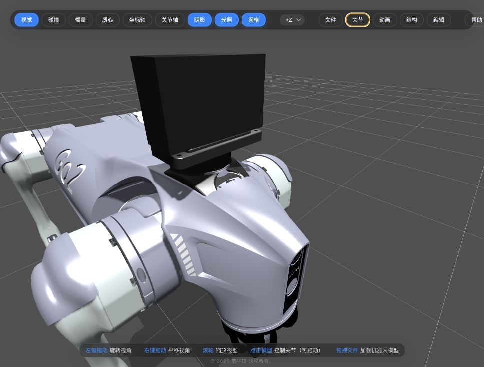

# Unitree Go2 Description

[中文](#中文) | [English](#english)

---

## 中文

Unitree Go2 四足机器人 URDF 模型描述包，包含基础版、Mid360 版和 Odin1 版。无需安装 ROS 2，在浏览器中即可可视化并调节关节。

### 可用模型

| 模型 | 文件 |
|---|---|
| 基础 Go2 | `xacro/go2.xacro` 或 `xacro/robot.xacro` |
| Go2 + Mid360 | `xacro/go2_with_mid360.xacro` |
| Go2 Air/EDU + Odin1 | `xacro/go2_with_odin1.xacro` 或 `urdf/go2_with_odin1.urdf` |

### 使用方法

**1. 克隆仓库**

```bash
git clone https://partnergitlab.renesas.solutions/pai/leggedrobot/unitree/go2_description.git
```

**2. 打开 RobotsFan Viewer**

👉 **[https://viewer.robotsfan.com/](https://viewer.robotsfan.com/)**

**3. 导入文件夹**

将克隆下来的 `go2_description` 文件夹整体拖入网页，网站自动识别加载。

**4. 打开模型**

在左侧文件树中双击 xacro 文件（如 `go2.xacro` 或 `robot.xacro`），3D 模型即在右侧显示。

**5. 调节关节角度**

右侧面板显示所有关节滑块，拖动或直接**输入数值**即可调整角度。例如：

| 关节 | 示例值 | 效果 |
|---|---|---|
| 四条腿的 calf_joint | `-1.5` | 蹲姿 |
| 四条腿的 hip_joint | `0.3` | 侧展 |
| FL_thigh + FR_thigh | `0.5` | 前腿前伸 |

> 直接在滑块旁的输入框里敲数字，比拖滑块更精确。

### 关节列表（共 12 个）

| 关节 | 所属腿 |
|---|---|
| `FL_hip_joint` / `FL_thigh_joint` / `FL_calf_joint` | 左前腿 |
| `FR_hip_joint` / `FR_thigh_joint` / `FR_calf_joint` | 右前腿 |
| `RL_hip_joint` / `RL_thigh_joint` / `RL_calf_joint` | 左后腿 |
| `RR_hip_joint` / `RR_thigh_joint` / `RR_calf_joint` | 右后腿 |

每条腿 3 个关节：髋 (hip)、大腿 (thigh)、小腿 (calf)，全部为 `revolute` 类型。

### Go2 Air/EDU + Odin1

`go2_with_odin1` 是包含 Go2、官方 Odin1 安装支架 STL、Odin1 设备外包络及传感器坐标系的整机模型。其固定 TF 链为：

```text
base_link
└── odin1_mount_link
    └── odin1_base_link
        └── odin1_lidar_link
```

- `odin1_mount_link` 使用 Manifold Tech `SRU-Odin` 提供的官方 `odin1_mount.stl`。
- Odin1 位于支架最高承托面上方；设备外壳没有公开 mesh，因此按官方 `100 × 62 × 33.5 mm` 尺寸显示为黑色外包络。
- `odin1_base_link` 是 Odin1 的 IMU/里程计基准，不是支架 STL 的中心。
- `odin1_base_link -> odin1_lidar_link` 使用官方固定平移 `[-0.02663, 0.03447, 0.02174] m`。
- 当前支架中心 `x=0.23 m` 来自实机视频与模型配准；用于精确标定前，仍需按实机安装孔和垫片厚度测量修正。

资料来源：[SRU-Odin 官方仓库](https://github.com/ManifoldTechLtd/SRU-Odin)、[Odin1 数据输出与 TF 说明](https://manifoldtechltd.github.io/wiki/odin_series/odin1/5.%20Data%20output_.html)。

ROS 2 / RViz2 查看：

```bash
ros2 launch go2_description go2_with_odin1.launch.py
```

使用本 URDF 时，应关闭 Odin 驱动中重复的根 TF 发布，避免 `odin1_base_link` 同时出现两个父节点。

### 截图




### 文件结构

```
go2_description/
├── xacro/
│   ├── robot.xacro          # 主模型入口（含四条腿）
│   ├── go2.xacro            # 备选入口
│   ├── leg.xacro            # 单腿宏定义
│   ├── const.xacro          # 物理参数与关节限位
│   ├── go2_with_mid360.xacro # Go2 + Mid360 整机入口
│   ├── go2_with_odin1.xacro  # Go2 + Odin1 整机入口
│   ├── materials.xacro      # 材质
│   └── transmission.xacro   # 传动
├── urdf/
│   └── go2_with_odin1.urdf  # Go2 + Odin1 完整 URDF
├── meshes/                  # 3D 网格 (.dae/.stl)
├── config/                  # 控制器配置
├── launch/                  # ROS 2 启动文件
└── rviz/                    # RViz 配置
```

---

## English

URDF model description for the Unitree Go2 quadruped robot, including base, Mid360, and Odin1 variants. No ROS 2 required — visualize and adjust joints directly in the browser.

### Available Models

| Model | File |
|---|---|
| Base Go2 | `xacro/go2.xacro` or `xacro/robot.xacro` |
| Go2 + Mid360 | `xacro/go2_with_mid360.xacro` |
| Go2 Air/EDU + Odin1 | `xacro/go2_with_odin1.xacro` or `urdf/go2_with_odin1.urdf` |

### Usage

**1. Clone**

```bash
git clone https://partnergitlab.renesas.solutions/pai/leggedrobot/unitree/go2_description.git
```

**2. Open RobotsFan Viewer**

👉 **[https://viewer.robotsfan.com/](https://viewer.robotsfan.com/)**

**3. Import the Folder**

Drag the cloned `go2_description` folder into the browser window. The site auto-detects and loads the model.

**4. Open the Model**

Double-click a xacro file (e.g. `go2.xacro` or `robot.xacro`) in the left file tree. The 3D model appears on the right.

**5. Adjust Joint Angles**

The right panel shows sliders for all joints. Drag them or **type a value** directly. Examples:

| Joint(s) | Value | Result |
|---|---|---|
| All `calf_joint` | `-1.5` | Crouch pose |
| All `hip_joint` | `0.3` | Legs spread sideways |
| `FL_thigh` + `FR_thigh` | `0.5` | Front legs reach forward |

> Type into the input box next to each slider for precise angles.

### Joint List (12 total)

| Joint | Leg |
|---|---|
| `FL_hip_joint` / `FL_thigh_joint` / `FL_calf_joint` | Front-left |
| `FR_hip_joint` / `FR_thigh_joint` / `FR_calf_joint` | Front-right |
| `RL_hip_joint` / `RL_thigh_joint` / `RL_calf_joint` | Rear-left |
| `RR_hip_joint` / `RR_thigh_joint` / `RR_calf_joint` | Rear-right |

3 joints per leg: hip, thigh, calf — all `revolute`.

### Go2 Air/EDU + Odin1

`go2_with_odin1` is the complete assembly containing the Go2, the official Odin1 mount STL, a dimensioned Odin1 device envelope, and sensor frames. Its fixed TF chain is:

```text
base_link
└── odin1_mount_link
    └── odin1_base_link
        └── odin1_lidar_link
```

- `odin1_mount_link` uses the official `odin1_mount.stl` from Manifold Tech `SRU-Odin`.
- Odin1 sits above the mount's highest support pad. No public housing mesh is available, so the device is represented by its official `100 × 62 × 33.5 mm` envelope.
- `odin1_base_link` is the Odin1 IMU/odometry reference frame, not the center of the mount STL.
- `odin1_base_link -> odin1_lidar_link` uses the official fixed translation `[-0.02663, 0.03447, 0.02174] m`.
- The current mount center at `x=0.23 m` is aligned from installation footage. Measure the physical mounting holes and spacer thickness before using it for precise calibration.

Sources: [official SRU-Odin repository](https://github.com/ManifoldTechLtd/SRU-Odin) and [Odin1 data output/TF documentation](https://manifoldtechltd.github.io/wiki/odin_series/odin1/5.%20Data%20output_.html).

View it in ROS 2 / RViz2:

```bash
ros2 launch go2_description go2_with_odin1.launch.py
```

When using this URDF, disable any duplicate root TF from the Odin driver so that `odin1_base_link` has only one parent.

### Screenshots


### File Structure

```
go2_description/
├── xacro/
│   ├── robot.xacro          # Main entry (4 legs)
│   ├── go2.xacro            # Alternate entry
│   ├── leg.xacro            # Single leg macro
│   ├── const.xacro          # Physics & joint limits
│   ├── go2_with_mid360.xacro # Go2 + Mid360 entry
│   ├── go2_with_odin1.xacro  # Go2 + Odin1 entry
│   ├── materials.xacro      # Materials
│   └── transmission.xacro   # Transmissions
├── urdf/
│   └── go2_with_odin1.urdf  # Complete Go2 + Odin1 URDF
├── meshes/                  # 3D meshes (.dae/.stl)
├── config/                  # Controller config
├── launch/                  # ROS 2 launch files
└── rviz/                    # RViz config
```

---

## License

The repository license remains TBD. The Odin1 mount STL is provided under the MIT license in `go2_description/LICENSES/SRU-Odin-MIT.txt`.
