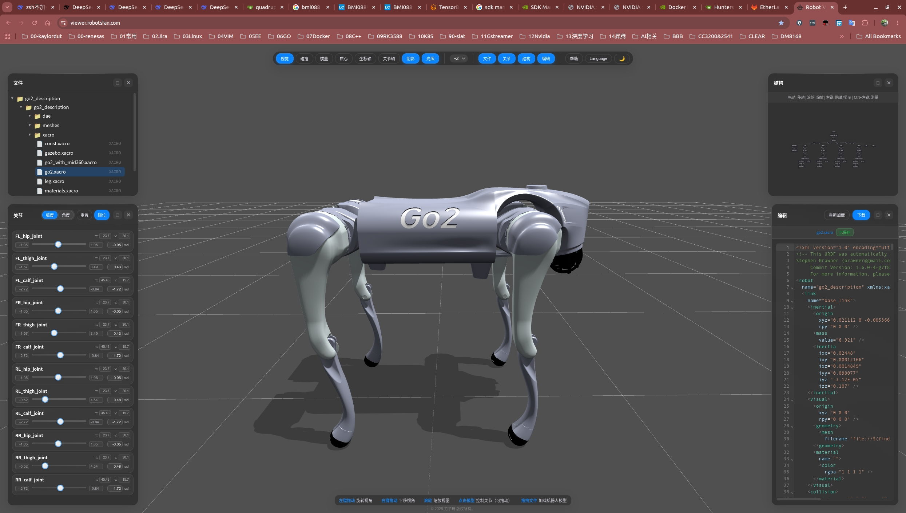

# Unitree Go2 Description

URDF model description for the Unitree Go2 quadruped robot. No ROS 2 required — visualize and adjust joints directly in the browser.

---

## Usage

### 1. Clone

```bash
git clone https://partnergitlab.renesas.solutions/leggedrobot/unitree/go2_description.git
```

### 2. Open RobotsFan Viewer

👉 **[https://viewer.robotsfan.com/](https://viewer.robotsfan.com/)**

### 3. Import the Folder

Drag the cloned `go2_description` folder into the browser window. The site auto-detects and loads the model.

### 4. Open the Model

Double-click a xacro file (e.g. `go2.xacro` or `robot.xacro`) in the left file tree. The 3D model appears on the right.

### 5. Adjust Joint Angles

The right panel shows sliders for all joints. Drag them or **type a value** directly. Examples:

| Joint(s) | Value | Result |
|---|---|---|
| All `calf_joint` | `-1.5` | Crouch pose |
| All `hip_joint` | `0.3` | Legs spread sideways |
| `FL_thigh` + `FR_thigh` | `0.5` | Front legs reach forward |

> Type into the input box next to each slider for precise angles.

---

## Joint List (12 total)

| Joint | Leg |
|---|---|
| `FL_hip_joint` / `FL_thigh_joint` / `FL_calf_joint` | Front-left |
| `FR_hip_joint` / `FR_thigh_joint` / `FR_calf_joint` | Front-right |
| `RL_hip_joint` / `RL_thigh_joint` / `RL_calf_joint` | Rear-left |
| `RR_hip_joint` / `RR_thigh_joint` / `RR_calf_joint` | Rear-right |

3 joints per leg: hip, thigh, calf — all `revolute`.

---

## Screenshots



---

## File Structure

```
go2_description/
├── xacro/
│   ├── robot.xacro          # Main entry (4 legs)
│   ├── go2.xacro            # Alternate entry
│   ├── leg.xacro            # Single leg macro
│   ├── const.xacro          # Physics & joint limits
│   ├── materials.xacro      # Materials
│   └── transmission.xacro   # Transmissions
├── meshes/                  # 3D meshes (.dae)
├── config/                  # Controller config
├── launch/                  # ROS 2 launch files
└── rviz/                    # RViz config
```

---

## License

TBD
